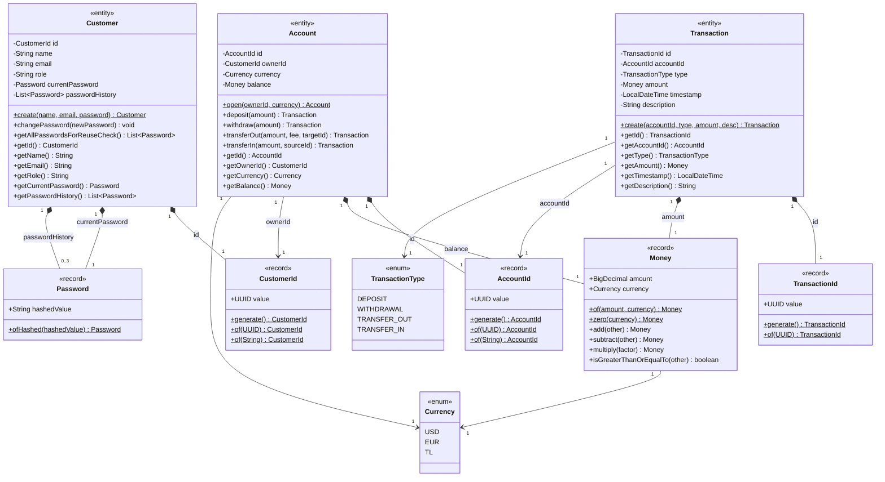
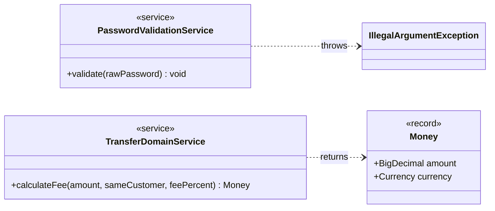
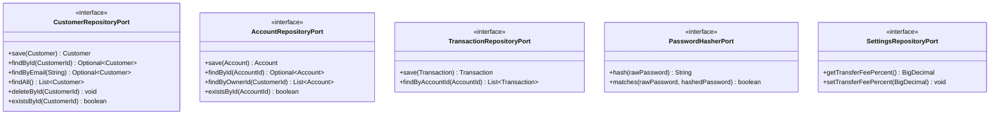
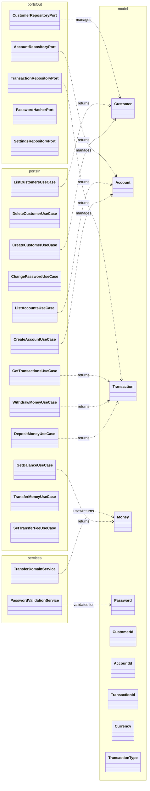

# Domain UML Class Diagrams

Package: `dev.kaldiroglu.hexagonal.ayvalikbank.domain`

--- 

## 1. Domain Model — Entities, Value Objects & Enums



---

## 2. Domain Services



---

## 3. Ports In — Use Cases (Driving / Inbound)

Each interface contains a nested `Command` record that carries the input data.

```mermaid
classDiagram
    direction TB

    class CreateCustomerUseCase {
        <<interface>>
        +createCustomer(Command) Customer
    }
    class `CreateCustomerUseCase.Command` {
        <<record>>
        +String name
        +String email
        +String rawPassword
    }
    CreateCustomerUseCase +-- `CreateCustomerUseCase.Command`

    class DeleteCustomerUseCase {
        <<interface>>
        +deleteCustomer(CustomerId) void
    }

    class ListCustomersUseCase {
        <<interface>>
        +listCustomers() List~Customer~
    }

    class ChangePasswordUseCase {
        <<interface>>
        +changePassword(Command) void
    }
    class `ChangePasswordUseCase.Command` {
        <<record>>
        +CustomerId customerId
        +String rawNewPassword
    }
    ChangePasswordUseCase +-- `ChangePasswordUseCase.Command`

    class CreateAccountUseCase {
        <<interface>>
        +createAccount(Command) Account
    }
    class `CreateAccountUseCase.Command` {
        <<record>>
        +CustomerId ownerId
        +Currency currency
    }
    CreateAccountUseCase +-- `CreateAccountUseCase.Command`

    class DepositMoneyUseCase {
        <<interface>>
        +deposit(Command) Transaction
    }
    class `DepositMoneyUseCase.Command` {
        <<record>>
        +AccountId accountId
        +Money amount
    }
    DepositMoneyUseCase +-- `DepositMoneyUseCase.Command`

    class WithdrawMoneyUseCase {
        <<interface>>
        +withdraw(Command) Transaction
    }
    class `WithdrawMoneyUseCase.Command` {
        <<record>>
        +AccountId accountId
        +Money amount
    }
    WithdrawMoneyUseCase +-- `WithdrawMoneyUseCase.Command`

    class GetBalanceUseCase {
        <<interface>>
        +getBalance(AccountId) Money
    }

    class GetTransactionsUseCase {
        <<interface>>
        +getTransactions(AccountId) List~Transaction~
    }

    class ListAccountsUseCase {
        <<interface>>
        +listAccounts(CustomerId) List~Account~
    }

    class TransferMoneyUseCase {
        <<interface>>
        +transfer(Command) void
    }
    class `TransferMoneyUseCase.Command` {
        <<record>>
        +AccountId sourceAccountId
        +AccountId targetAccountId
        +Money amount
    }
    TransferMoneyUseCase +-- `TransferMoneyUseCase.Command`

    class SetTransferFeeUseCase {
        <<interface>>
        +setTransferFee(Command) void
    }
    class `SetTransferFeeUseCase.Command` {
        <<record>>
        +BigDecimal feePercent
    }
    SetTransferFeeUseCase +-- `SetTransferFeeUseCase.Command`
```

---

## 4. Ports Out — Repository & Infrastructure (Driven / Outbound)



---

## 5. Full Domain Overview — Ports, Services & Model Together


