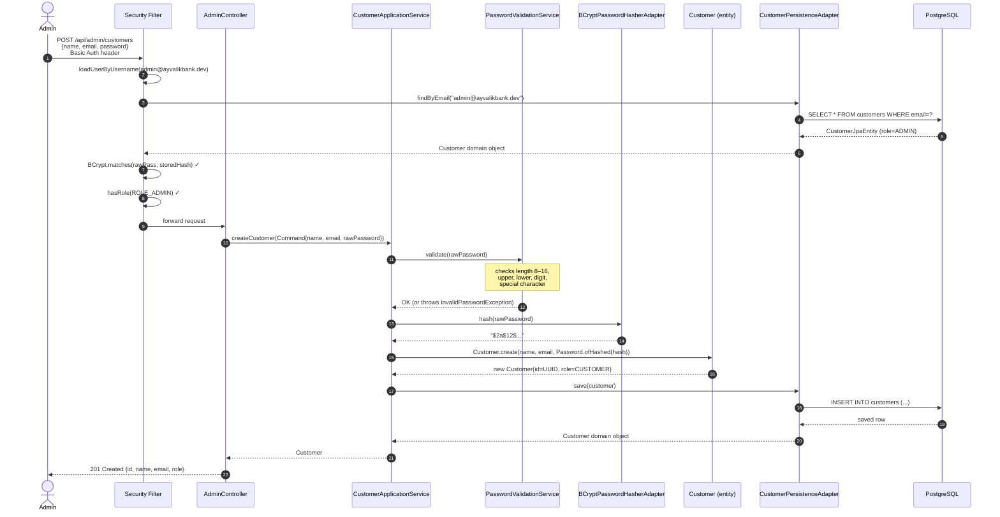
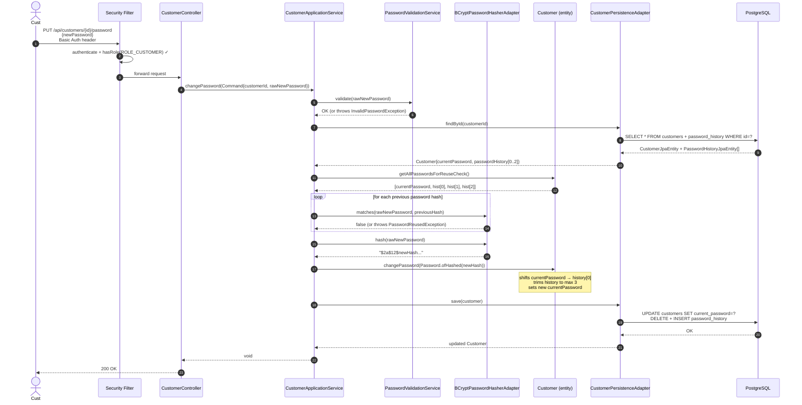
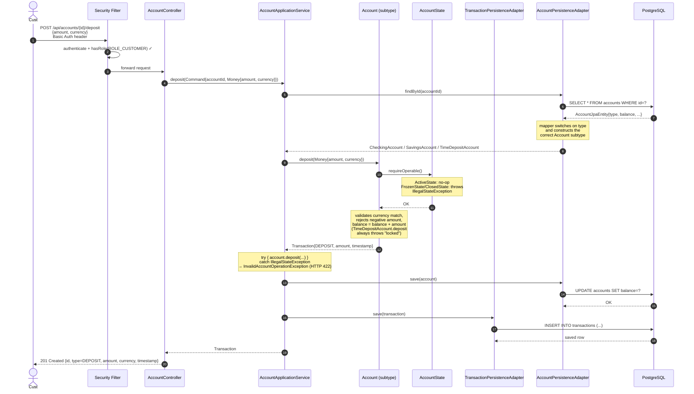
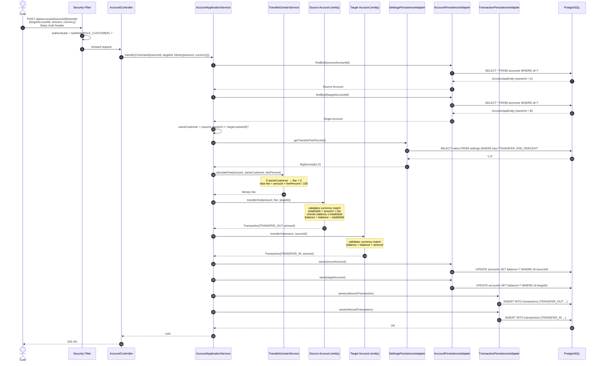
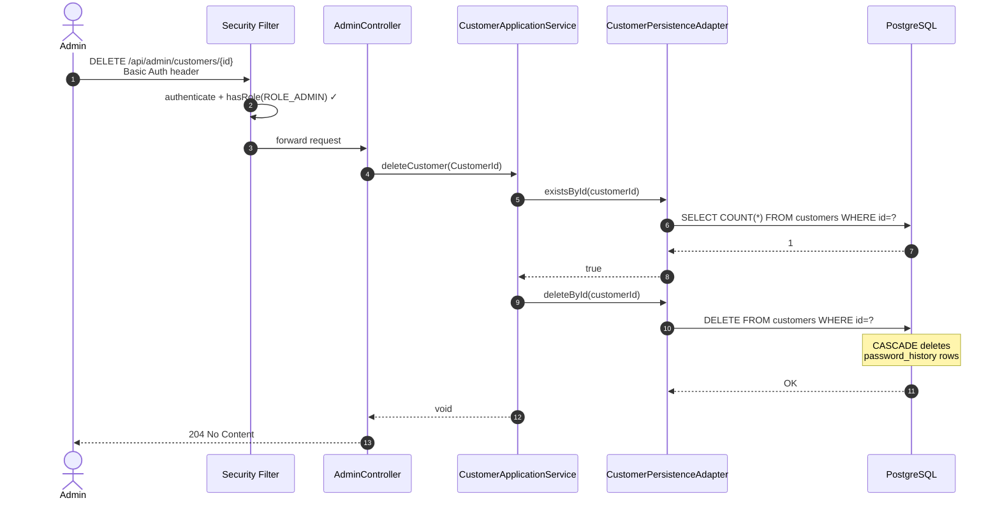
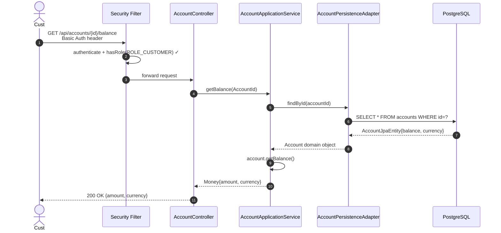
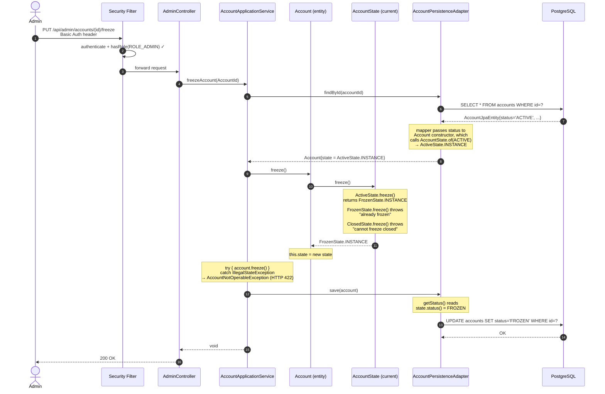
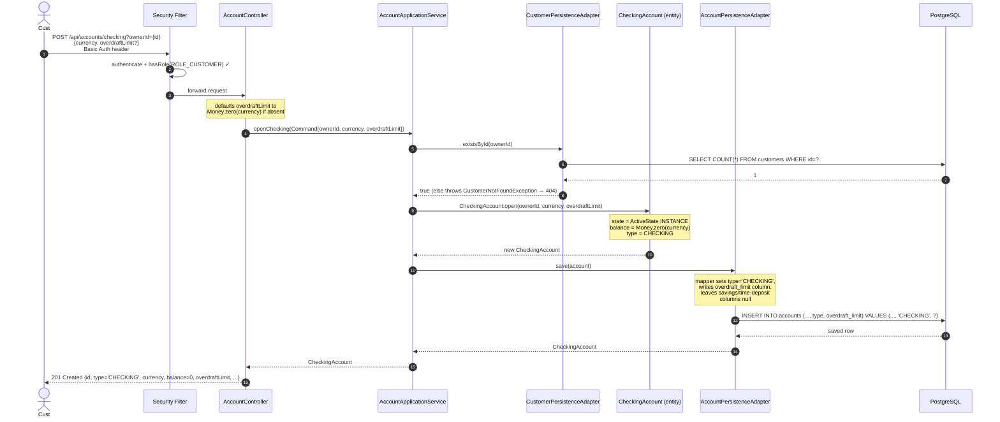
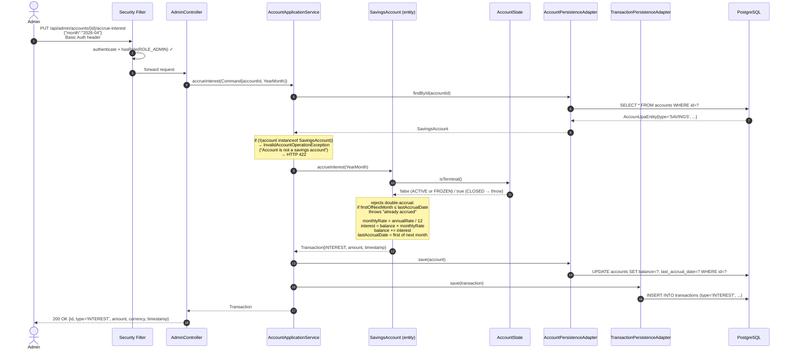
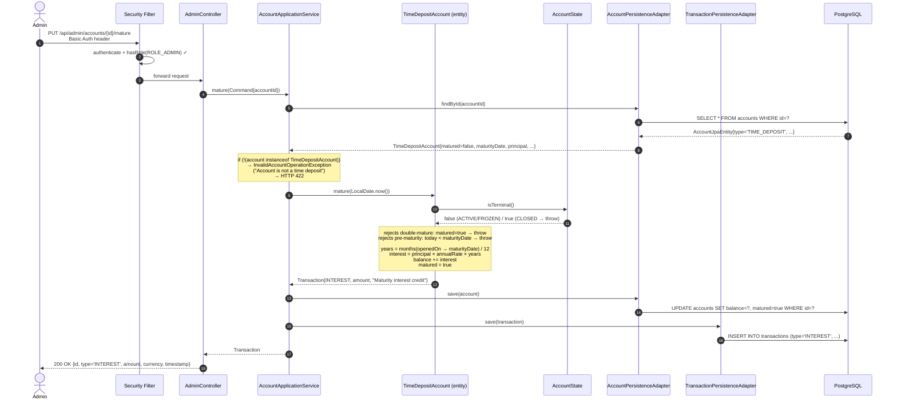

# Use Case Flow Diagrams — Ayvalık Bank HA-1

Each diagram shows the full call chain from the HTTP client through every architectural layer.

**Layer key:**

| Lane | Layer |
|------|-------|
| Actor | Human user (Admin / Customer) |
| Security | Spring Security filter chain |
| Controller | Inbound adapter (REST) |
| AppService | Application service (orchestration) |
| Domain | Entities and domain services (pure Java) |
| Persistence | Outbound adapter (JPA) |
| DB | PostgreSQL |

---

## 1. CreateCustomerUseCase

Admin creates a new customer with a validated, hashed password.

---

## 2. ChangePasswordUseCase

Customer changes their own password. New password must pass format rules and must not match the last 3 used passwords.

---

## 3. DepositMoneyUseCase

Customer deposits money into one of their accounts. The persistence adapter reconstructs the correct `Account` subtype (`CheckingAccount`, `SavingsAccount`, or `TimeDepositAccount`) based on the `type` discriminator column; each subtype overrides `deposit` with its own rules. `TimeDepositAccount.deposit` always throws — the application service maps that to HTTP 422.

---

## 4. TransferMoneyUseCase

The most complex flow. Customer transfers money between accounts. Fee is 0% for same-customer transfers; admin-configured % for cross-customer transfers. The source account's `transferOut` follows subtype-specific rules: `CheckingAccount` allows the balance to go negative down to `-overdraftLimit`; `SavingsAccount` rejects any overdraw; `TimeDepositAccount` always throws ("transfers not supported"). Any `IllegalStateException` is wrapped by the service as `InvalidAccountOperationException` (HTTP 422).

---

## 5. DeleteCustomerUseCase

Admin deletes an existing customer by ID.

---

## 6. GetBalanceUseCase

Customer queries the current balance of an account.

---

## 7. FreezeAccountUseCase

Admin freezes an account. The state transition is implemented with the **State pattern** — `Account.freeze()` is a one-line delegation to `state.freeze()`, which returns the new state instance (or throws if the transition is invalid).

> **Unfreeze** (`PUT /api/admin/accounts/{id}/unfreeze`) follows the same flow with `account.unfreeze()` → `state.unfreeze()`: `FrozenState` returns `ActiveState.INSTANCE`; `ActiveState`/`ClosedState` throw.
>
> **Close** (`PUT /api/admin/accounts/{id}/close`) follows the same flow with `account.close()` → `state.close()`: `ActiveState` and `FrozenState` return `ClosedState.INSTANCE`; `ClosedState` throws ("already closed"). `CLOSED` is terminal.

---

## 8. OpenCheckingAccountUseCase

Customer opens a new checking account, optionally with an overdraft limit. Two parallel flows exist for `POST /api/accounts/savings` (rate field, `SavingsAccount`) and `POST /api/accounts/time-deposit` (principal/maturity/rate fields, `TimeDepositAccount`) — same shape, different command and factory.

---

## 9. AccrueInterestUseCase

Admin triggers a monthly interest accrual on a savings account. The application service rejects the request if the account is not a `SavingsAccount`. Frozen savings accounts still accrue (interest is a system action, not a customer action); closed accounts do not.

---

## 10. MatureTimeDepositUseCase

Admin matures a time deposit. Maturation credits the full annualised interest (`principal × rate × yearsHeld`) as a single `INTEREST` transaction, sets the `matured` flag (which unlocks future withdrawals), and is rejected if the account is closed, already matured, or before the maturity date. Frozen time deposits can still be matured.

> After maturation, `withdraw` becomes available on the time deposit (subject to the standard `requireOperable()` state check). `deposit` and `transferOut` remain forbidden by design — the principal stays "fixed".
