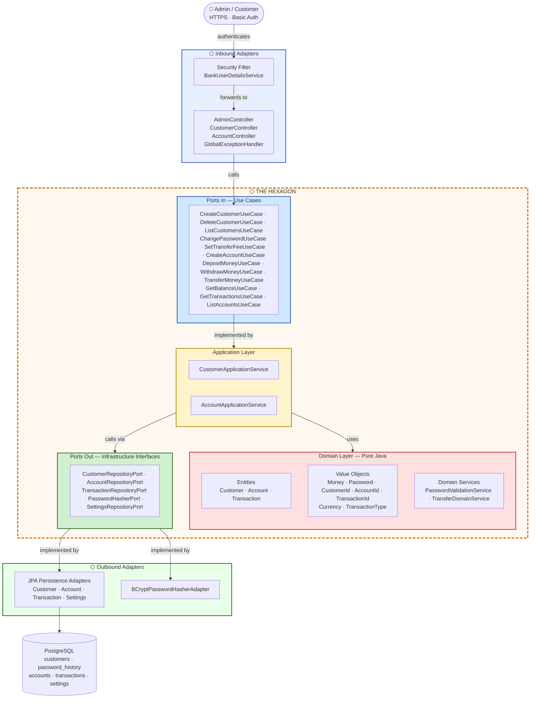

# Hexagonal Architecture Diagram — Ayvalık Bank CC-1

---

## ASCII Representation

```
                         ┌─────────────────────────┐
                         │       HTTP Clients       │
                         │    Admin     Customer    │
                         └────────────┬────────────┘
                                      │  HTTPS / Basic Auth
                    ╔═════════════════╪══════════════════════╗
                    ║  INBOUND ADAPTERS                      ║
                    ║  ┌─────────────────────────────────┐   ║
                    ║  │  Security Filter (Basic Auth)   │   ║
                    ║  │  BankUserDetailsService         │   ║
                    ║  └─────────────────────────────────┘   ║
                    ║  ┌───────────────┐ ┌───────────────┐   ║
                    ║  │AdminController│ │AccountCtrl    │   ║
                    ║  │CustomerCtrl   │ │GlobalException│   ║
                    ║  └───────┬───────┘ └───────┬───────┘   ║
                    ╚══════════╪═════════════════╪══════════╝
                               │  calls use-case interfaces
                          ╱────┴─────────────────┴────╲
                        ╱                               ╲
                       ╱   ┌─────────────────────────┐   ╲
                      ╱    │        PORTS IN          │    ╲
                     ╱     │  CreateCustomerUseCase   │     ╲
                    ╱      │  DeleteCustomerUseCase   │      ╲
                   │       │  ListCustomersUseCase    │       │
                   │       │  ChangePasswordUseCase   │       │
                   │       │  SetTransferFeeUseCase   │       │
                   │       │  CreateAccountUseCase    │       │
                   │       │  DepositMoneyUseCase     │       │
                   │       │  WithdrawMoneyUseCase    │       │
                   │       │  TransferMoneyUseCase    │       │
                   │       │  GetBalanceUseCase       │       │
                   │       │  GetTransactionsUseCase  │       │
                   │       │  ListAccountsUseCase     │       │
                   │       └────────────┬────────────┘       │
                   │                    │  implemented by     │
                   │       ┌────────────▼────────────┐       │
                   │       │    APPLICATION LAYER     │       │
                   │       │                          │       │
     T H E         │       │ CustomerApplicationSvc   │       │  H E X A G O N
                   │       │ AccountApplicationSvc    │       │
                   │       └────────────┬────────────┘       │
                   │                    │  uses               │
                   │       ┌────────────▼────────────┐       │
                   │       │       DOMAIN LAYER       │       │
                   │       │  ── Entities ──          │       │
                   │       │  Customer                │       │
                   │       │  Account                 │       │
                   │       │  Transaction             │       │
                   │       │  ── Value Objects ──     │       │
                   │       │  Money  Password         │       │
                   │       │  CustomerId  AccountId   │       │
                   │       │  TransactionId           │       │
                   │       │  Currency  TransactionType│      │
                   │       │  ── Domain Services ──   │       │
                   │       │  PasswordValidationSvc   │       │
                   │       │  TransferDomainService   │       │
                   │       └────────────┬────────────┘       │
                   │                    │  declares           │
                   │       ┌────────────▼────────────┐       │
                   │       │        PORTS OUT         │       │
                   │       │  CustomerRepositoryPort  │       │
                   │       │  AccountRepositoryPort   │       │
                   │       │  TransactionRepository   │       │
                   │       │  PasswordHasherPort      │       │
                   │       │  SettingsRepositoryPort  │       │
                   │       └─────────────────────────┘       │
                    \                                        ╱
                     \                                      ╱
                      ╲────────────────────────────────────╱
                               │  implemented by
                    ╔══════════╪═══════════════════════════════╗
                    ║  OUTBOUND ADAPTERS                        ║
                    ║  ┌────────────────────┐  ┌────────────┐  ║
                    ║  │ Persistence        │  │ Security   │  ║
                    ║  │ CustomerPersistence│  │ BCrypt     │  ║
                    ║  │ AccountPersistence │  │ Password   │  ║
                    ║  │ TransactionPersist │  │ Hasher     │  ║
                    ║  │ SettingsPersistence│  │ Adapter    │  ║
                    ║  └─────────┬──────────┘  └─────┬──────┘  ║
                    ╚════════════╪═══════════════════╪════════╝
                                 │  JDBC / JPA        │ BCrypt
                    ┌────────────▼───────────────┐    │
                    │        PostgreSQL           │◄───┘
                    │  ┌──────────────────────┐  │
                    │  │ customers            │  │
                    │  │ password_history     │  │
                    │  │ accounts             │  │
                    │  │ transactions         │  │
                    │  │ settings             │  │
                    │  └──────────────────────┘  │
                    └────────────────────────────┘
```

---

## Mermaid Flowchart



---

## Key Rule

> **All arrows cross the hexagon boundary from outside in — never from inside out.**
> The domain layer has zero imports from Spring, JPA, BCrypt, or any adapter.

| Zone | Contents | Depends on |
|------|----------|-----------|
| Domain Layer | Entities, Value Objects, Domain Services | Nothing |
| Ports In | Use-case interfaces + Command records | Domain model types only |
| Ports Out | Repository + infrastructure interfaces | Domain model types only |
| Application Layer | Application services | Domain layer + Ports In + Ports Out |
| Inbound Adapters | REST controllers, Security | Application layer (via Ports In) |
| Outbound Adapters | JPA adapters, BCrypt adapter | Ports Out (implements them) |
| Infrastructure | PostgreSQL | — |
